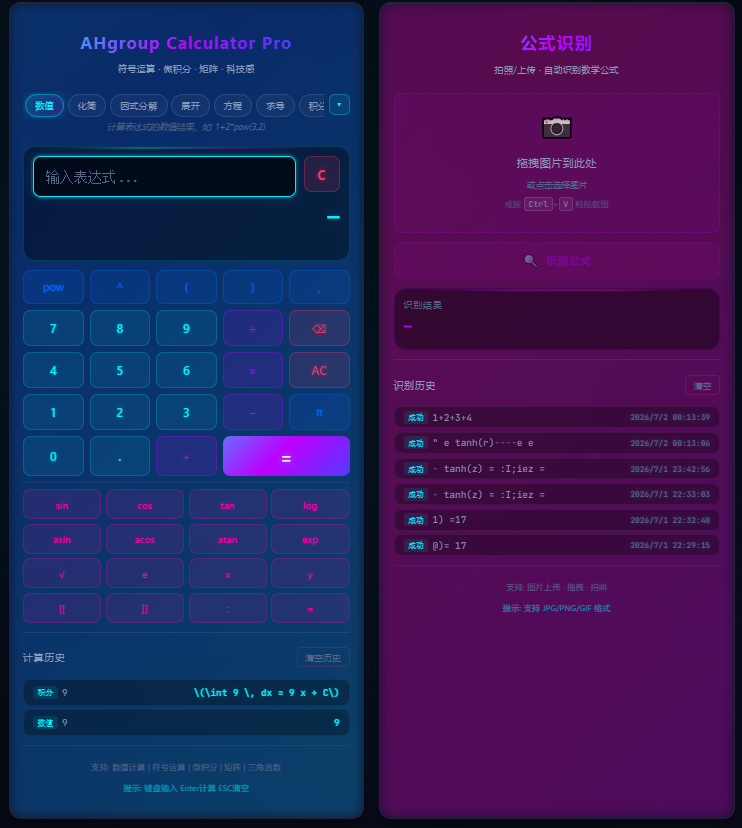
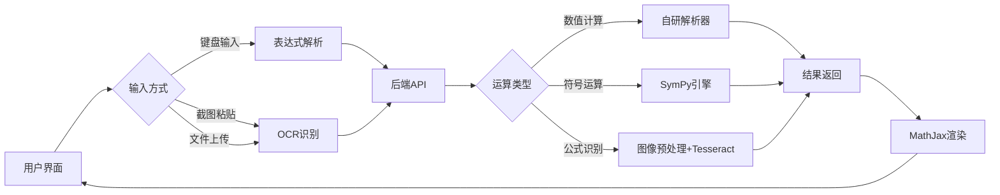
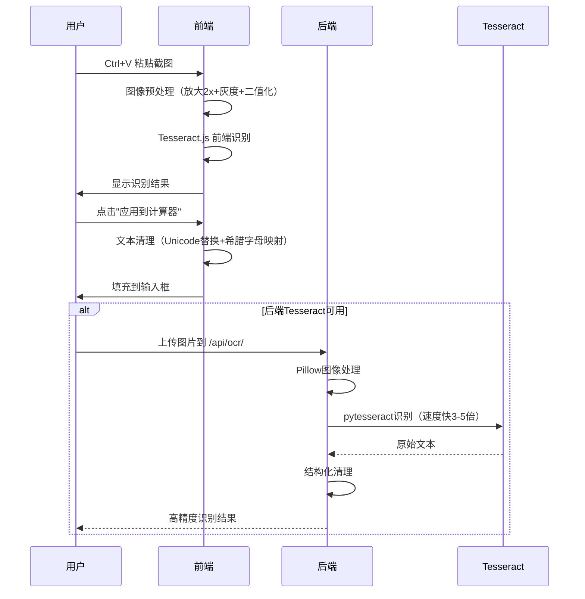

# AHgroup Calculator Pro

> **基于 Django + SymPy 的高级科学计算器 Web 应用**
>
> 前后端分离架构 | 支持 19 种运算模式 | OCR 公式识别



## 项目简介

本项目是一款面向数学学习和工程计算的高级科学计算器 Web 应用，采用**前后端分离架构**设计。前端为科技感霓虹主题的交互界面，后端基于 Django + SymPy 符号数学引擎，支持从基础数值计算到高等数学符号运算的全方位功能。

项目通过**人机协作开发**完成，在与 AI 的交互过程中逐步迭代升级，实现了双列响应式布局、OCR 公式识别、积分显式渲染等高级功能。

## 核心功能

### 1. 19 种运算模式

| 类别 | 模式 | 示例 |
|------|------|------|
| **基础计算** | 数值计算 | `1+2*pow(3,2)` → `19` |
| **代数运算** | 化简 / 因式分解 / 展开 | `x^2-1` → `(x-1)(x+1)` |
| **方程求解** | 求解方程 | `x^2-4=0` → `[-2, 2]` |
| **微积分** | 求导 / 不定积分 / 定积分 | `∫ x² dx = x³/3 + C` |
| **矩阵运算** | 加减乘 / 行列式 / 逆矩阵 / 转置 / 秩 / 特征值 | `[[1,2],[3,4]]` → `-2` |
| **三角函数** | 化简 / 展开 | `sin(x)^2+cos(x)^2` → `1` |
| **高级分析** | 极限 / 泰勒展开 / 级数求和 | `sin(x)/x` → `1` (x→0) |
| **输出格式** | LaTeX 格式化输出 | `x^2+1` → `x^{2} + 1` |

### 2. OCR 公式识别

支持**拖拽上传 / 点击选择 / Ctrl+V 粘贴截图**三种方式识别数学公式：

- 前端 Tesseract.js 浏览器端实时识别
- 后端 pytesseract 高性能识别（需安装 Tesseract 引擎）
- 图像预处理：放大 2x + 灰度化 + 二值化 + 字符白名单过滤
- 智能文本清理：Unicode 符号替换、希腊字母映射、分数结构化

### 3. 科技感 UI 设计

- **霓虹色调**：青色 + 紫色 + 粉色渐变发光效果
- **玻璃拟态**：backdrop-filter 模糊卡片设计
- **动态光效**：边框渐变动画、扫描线纹理、按键悬停缩放
- **响应式布局**：双列（大屏）/ 单列（中小屏）自适应

### 4. 智能交互体验

- **模式自适应**：根据运算模式自动显示/隐藏变量输入框、定积分上下限
- **实时验证**：500ms 防抖调用后端语法验证 API
- **计算历史**：带模式标签的历史记录，点击可复用表达式
- **键盘全支持**：Enter 计算、ESC 清空、物理键盘直接输入
- **积分显式渲染**：MathJax 3 将 LaTeX 渲染为数学公式

## 技术栈

| 层级 | 技术 | 说明 |
|------|------|------|
| 前端 | HTML5 + CSS3 + Vanilla JS | 无框架依赖，单页面应用，响应式双列布局 |
| 后端 | Django 5.x + Python 3.13 | RESTful API，提供 19 种运算接口 |
| 符号运算 | SymPy 1.13 | Python 符号数学库，支持微积分、矩阵、LaTeX |
| 基础计算 | 自研递归下降解析器 | 支持 sin/cos/log/pi/e 等常量和函数 |
| 公式渲染 | MathJax 3 | 积分结果显式渲染为数学公式 |
| 前端 OCR | Tesseract.js (CDN) | 浏览器端运行，无需额外安装 |
| 后端 OCR | pytesseract + Pillow | 后端调用 Tesseract 引擎，速度快 3-5 倍 |
| 部署 | Django 开发服务器 | 一键启动脚本 `run.py` |

## 系统架构



## 前后端分离设计

### 后端 API（Django RESTful）

```
POST /api/calculate/      → 基础数值计算
POST /api/advanced/       → 高级符号运算（19种模式）
POST /api/validate/       → 表达式语法验证
POST /api/ocr/            → 图片公式识别
GET  /api/modes/          → 获取运算模式列表
GET  /api/history/        → 获取计算历史
POST /api/clear-history/  → 清空历史记录
```

### 优雅降级策略

当 SymPy 未安装时，系统通过 `try/except` 捕获 `ImportError`，自动回退至基础数值计算模式，确保核心功能始终可用。

## OCR 公式识别流程



## 快速启动

```bash
# 方式一：一键启动（推荐）
python run.py

# 方式二：手动启动
python manage.py migrate
python manage.py runserver 0.0.0.0:8000
```

访问 http://127.0.0.1:8000/ 即可使用。

## 环境依赖

```bash
pip install django sympy Pillow pytesseract
```

> **注意**：后端 OCR 需要额外安装 Tesseract 引擎（Windows 下载地址：https://github.com/UB-Mannheim/tesseract/wiki）

## 未来优化方向

### 1. OCR 识别准确率提升（高优先级）

当前 Tesseract 是通用 OCR 引擎，对复杂数学公式（分数、上下标、根号等）识别准确率有限：

- **简单公式**（`x^2+1`、`sin(x)`）：准确率约 80%
- **复杂分数**（`(e^x-e^{-x})/(e^x+e^{-x})`）：准确率较低，易识别为乱码

**优化方案**：
- [ ] 接入 **SimpleTex API** 或 **Mathpix API**（专业数学公式 OCR）
- [ ] 训练专用数学公式识别模型（基于 CNN + Transformer）
- [ ] 增加手写公式识别支持（接入百度手写识别或 Google Cloud Vision）
- [ ] 优化图像预处理 pipeline：自适应阈值、去噪、倾斜校正

### 2. 功能扩展

- [ ] **绘图功能**：集成 matplotlib 或 Plotly，实现函数图像绘制
- [ ] **持久化历史**：将计算历史存入 SQLite 数据库，实现跨会话保留
- [ ] **用户系统**：注册/登录，支持个人历史记录和收藏表达式
- [ ] **语音输入**：集成 Web Speech API 实现语音输入表达式
- [ ] **代码导出**：将计算结果导出为 Python/SymPy 代码片段
- [ ] **移动端适配**：优化触屏交互，支持手势操作

### 3. 性能优化

- [ ] **WebSocket 实时通信**：替换轮询，降低延迟
- [ ] **计算缓存**：缓存常见表达式计算结果
- [ ] **渐进式 Web 应用（PWA）**：支持离线使用和桌面安装

## 人机协作开发记录

本项目通过与 AI 交互协作完成，开发过程中记录了完整的技术决策、问题排查与修复过程。详见：

- [AI交互说明.md](AI交互说明.md) — 架构设计、技术选型、问题排查、环境配置
- [使用说明.md](使用说明.md) — 用户操作指南

## 项目结构

```
├── calculator_project/       # Django 项目配置
│   ├── settings.py           # 项目设置（跨域、静态文件）
│   ├── urls.py               # 根路由
│   └── wsgi.py / asgi.py     # 服务入口
├── calculator_api/           # 核心应用
│   ├── views.py              # API 视图（19种运算 + OCR）
│   ├── calculator_core.py   # 自研数值计算引擎
│   └── urls.py               # API 路由
├── templates/
│   └── index.html            # 单页面前端（霓虹科技主题）
├── static/
│   ├── css/style.css         # 样式表（发光、动画、响应式）
│   └── js/app.js             # 前端逻辑（OCR、键盘、模式切换）
├── assets/
│   └── screenshot.png        # 项目界面截图
├── run.py                    # 一键启动脚本
├── manage.py                 # Django 管理脚本
├── AI交互说明.md             # 开发文档
├── 使用说明.md               # 用户文档
└── README.md                 # 本文件
```

## 个人贡献

本项目为**专业实习实训课程任务**，通过人机协作完成：

- **架构设计**：与 AI 协作设计前后端分离架构，确定技术栈选型
- **前端开发**：实现科技感霓虹 UI、双列响应式布局、OCR 交互逻辑
- **后端开发**：配置 Django 项目、实现 RESTful API、集成 SymPy 符号运算
- **问题排查**：修复 sympy 安装损坏、前端布局截断、端口占用等环境问题
- **OCR 优化**：实现图像预处理、字符白名单、文本清理等优化策略
- **文档撰写**：编写 AI 交互说明、使用说明、技术文档

## 技术亮点

1. **符号数学引擎**：基于 SymPy 实现 19 种运算模式，覆盖从高中到大学数学
2. **双 OCR 架构**：前端 Tesseract.js（零依赖）+ 后端 pytesseract（高性能），双层保障
3. **优雅降级**：SymPy 缺失时自动回退基础计算，确保系统可用性
4. **响应式双列布局**：大屏双列并排、小屏单列适配，用户体验一致
5. **积分显式渲染**：MathJax 将 LaTeX 渲染为数学公式，直观展示积分结果

## 许可证

本项目为课程实训作品，仅供学习交流使用。

---

> 📌 **GitHub**: https://github.com/permanent234/ahgroup-calculator-pro
